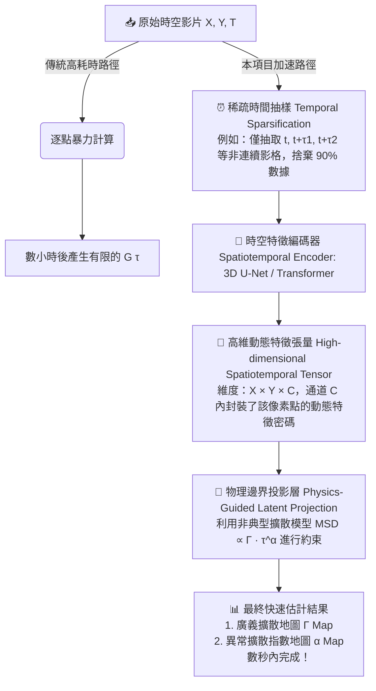

# 技術概念說明書 (Concept Note)

**項目名稱**：基於時空自我監督學習之快速 iSCORS 自相關映射（Autocorrelation Map）估計系統

## 核心痛點
傳統 iSCORS (Interferometric Spatiotemporal Correlation Spectroscopy) 為了在空間中繪製分子的動態地圖，必須針對影像中的每一個像素點（Pixel-by-pixel），在不同的時間延遲 $\tau$ 下進行暴力的時間序列互相關運算。這種逐點計算（Pixel-wise brute-force calculation）面臨巨大的計算瓶頸：
- **時間成本極高**： 處理一段數萬幀的高速顯微影片通常需要數小時甚至數天。
- **記憶體吞吐量大**： 需要將龐大的 3D 時空數據方塊完整載入並反覆切片。

## 💡 核心創新概念：時間稀疏抽樣與神經網絡插值
本項目提出一種 **Physics-Informed Self-Supervised Learning (PISSL)** 架構，旨在利用深度學習「看穿雜訊並捕捉時空連續性」的能力，將計算複雜度降低數個數量級。

我們不對全量影格進行逐點計算，而是將影片視為一個低熵（Low-entropy）的物理連續系統。透過稀疏抽取時間步長 $\tau$，訓練一個時空編碼器，直接預測高維的動態特徵，並將其投影至異常擴散物理空間。

## 🛠️ 系統架構與算法流程

## 🧬 自我監督訓練機制 (無標籤訓練)
本系統的核心在於無需外部 Ground Truth (GT)，完全依賴影片自身的時空結構進行內部學習（Internal Learning）：

### 1. 代理任務 (Pretext Task)：時空掩碼重建 (Spatiotemporal Masked Autoencoder)
- **輸入 (Input)**： 將影片隨機切成 $64 \times 64 \times T$ 的時空局部方塊（Patches），並隨機遮蔽（Mask）掉 80% 的影格，僅留下稀疏的 $\tau$ 抽樣影格。
- **模型任務**： 預測並重建那些被遮蔽的像素。
- **損失函數 (Loss Function)**：
  $$Loss_{\text{recon}} = \| I_{\text{predicted}}(x,y,t) - I_{\text{true}}(x,y,t) \|^2$$
- **物理意義**：神經網絡為了完美重構消失的影格，必須在 Latent Space 中學會粒子擴散與布朗運動的物理規律。

### 2. 物理資訊損失約束 (Physics-Informed Loss)
為了讓高維通道 $C$ 的特徵具有可解釋性，我們引入物理退火機制。解碼器（Decoder）會將高維特徵投影為 $\Gamma(x,y)$ 與 $\alpha(x,y)$，並強制其符合非典型擴散（Anomalous Diffusion）的自相關衰減理論：
$$Loss_{\text{physics}} = \| G_{\text{predicted}}(\tau; \Gamma, \alpha) - G_{\text{rough}}(\tau) \|^2$$
